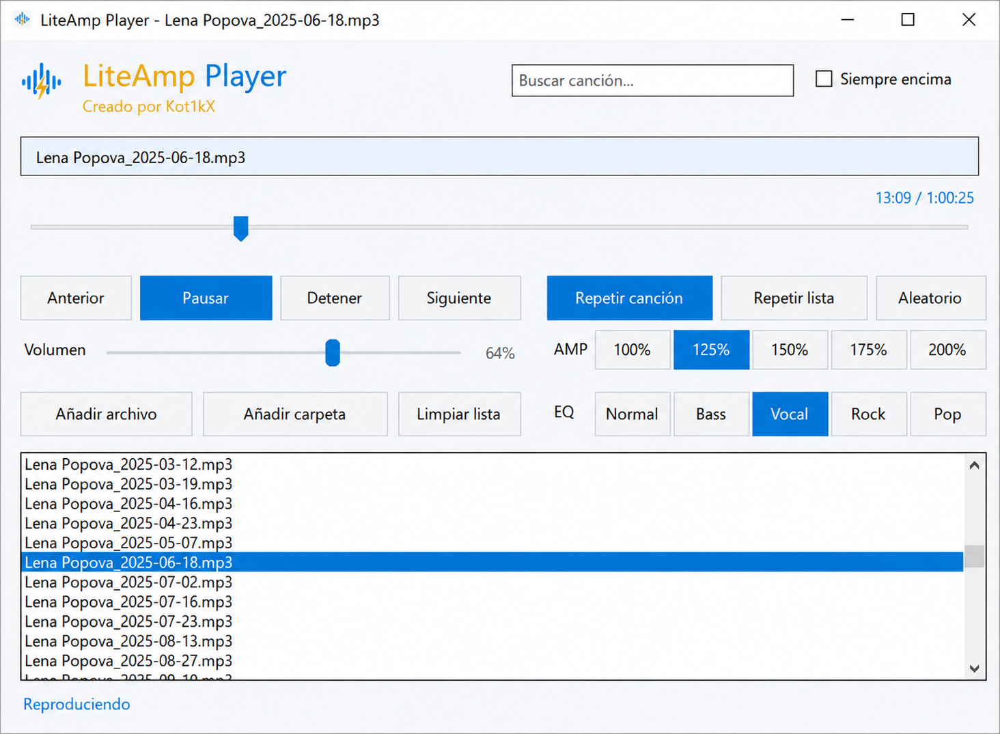

# LiteAmp Player

**LiteAmp Player** es un reproductor de audio ligero para Windows, pensado para abrir música local sin cuentas, sin nube, sin anuncios y sin telemetría propia.

## Características

* Reproducción local de música.
* Playlist con navegación rápida.
* Búsqueda integrada en la lista.
* Controles de reproducción: anterior, reproducir/pausar, detener y siguiente.
* Modos de reproducción: repetir canción, repetir lista y aleatorio.
* Control de volumen propio con rueda del ratón.
* Amplificador integrado: 100%, 125%, 150%, 175% y 200%.
* Presets EQ: Normal, Bass, Vocal, Rock y Pop.
* Interfaz sencilla, en castellano y sin elementos innecesarios.
* Portable: ejecutar y usar.

## Formatos compatibles

* MP3
* WAV
* FLAC
* AAC
* M4A

## Privacidad

LiteAmp Player está diseñado para funcionar de forma local.

* Sin cuentas.
* Sin nube.
* Sin publicidad.
* Sin telemetría propia.
* Sin servicios en segundo plano.
* Sin sincronización externa.
* Sin envío de biblioteca musical.

La música se reproduce desde el equipo del usuario. El programa no necesita conexión a internet para funcionar.

## Aviso sobre volumen y amplificador

LiteAmp Player incluye un amplificador de volumen que puede superar el nivel estándar de reproducción. El usuario es responsable de ajustar el volumen de forma segura según sus auriculares, altavoces y entorno.

El uso de niveles elevados puede causar distorsión, molestias auditivas o daños en equipos de audio si se utiliza de forma imprudente. La música pertenece al usuario; el volumen elegido también.

## Uso

1. Descarga el ZIP portable desde la sección **Releases**.
2. Extrae la carpeta.
3. Ejecuta `LiteAmpPlayer.exe`.
4. Añade archivos o carpetas de música.

## Stack técnico

* Windows
* .NET
* WinForms
* NAudio

## Estado

Versión actual: **v0.2.6**

Esta versión cierra la rama WinForms con el pulido visual y funcional necesario para uso normal. El objetivo del proyecto sigue siendo el mismo: un reproductor pequeño, práctico, local y sin dependencias innecesarias.

